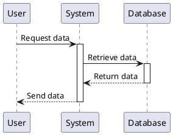

# Flowcart

Start typing here...


```mermaid

```

{src="seq.mermaid"}


```mermaid

sequenceDiagram

    participant User

    participant System

    participant Database


    User->>System: Request data

    activate System

    System->>Database: Retrieve data

    activate Database

    Database-->>System: Return data

    deactivate Database

    System-->>User: Send data

    deactivate System

```



{collapsible="true" collapsed-title-line-number="1"} 
