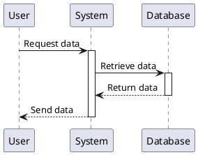

# Flowcart

Start typing here...


```mermaid

```

{src="seq.mermaid"}


```mermaid

sequenceDiagram

    participant User

    participant System

    participant Database


    User->>System: Request data

    activate System

    System->>Database: Retrieve data

    activate Database

    Database-->>System: Return data

    deactivate Database

    System-->>User: Send data

    deactivate System

```



{collapsible="true" collapsed-title-line-number="1"} 

```Java
import java.util.Scanner;

public class HelloWorld {

    public static void main(String[] args) {

        // Creates a reader instance which takes
        // input from standard input - keyboard
        Scanner reader = new Scanner(System.in);
        System.out.print("Enter a number: ");

        // nextInt() reads the next integer from the keyboard
        int number = reader.nextInt();

        // println() prints the following line to the output screen
        System.out.println("You entered: " + number);
    }
}
```

<code-block lang="java">
import java.util.Scanner;

public class HelloWorld {

    public static void main(String[] args) {

        // Creates a reader instance which takes
        // input from standard input - keyboard
        Scanner reader = new Scanner(System.in);
        System.out.print("Enter a number: ");

        // nextInt() reads the next integer from the keyboard
        int number = reader.nextInt();

        // println() prints the following line to the output screen
        System.out.println("You entered: " + number);
    }
}
</code-block>
