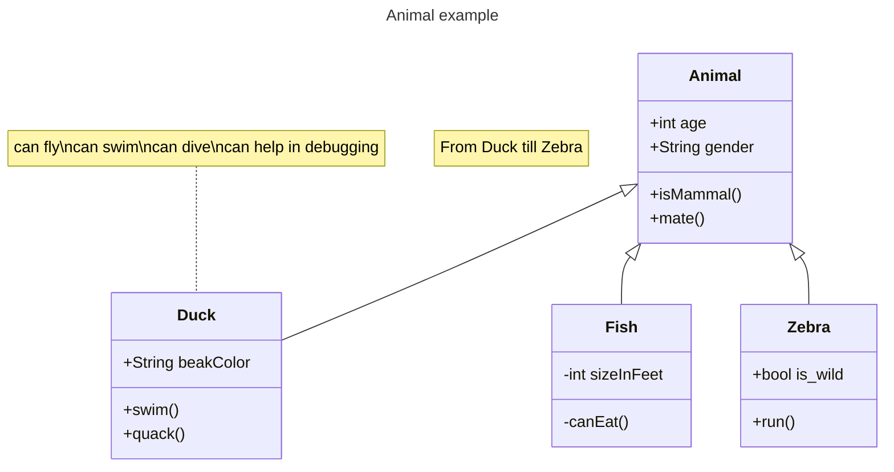
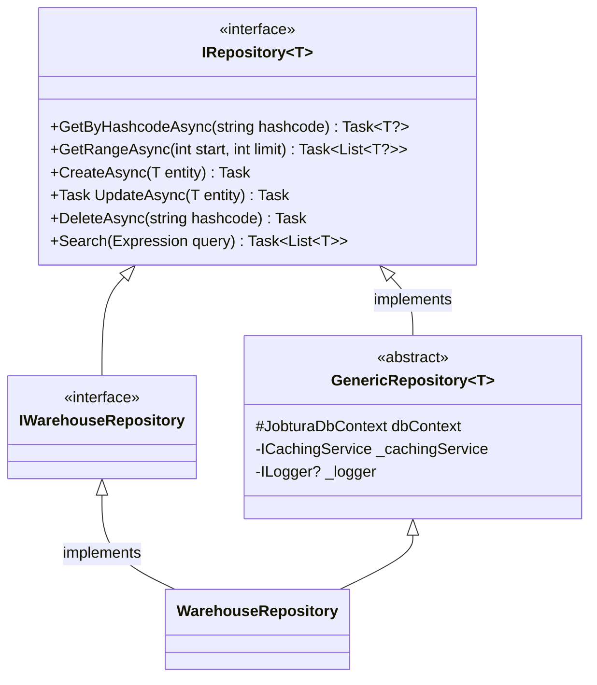
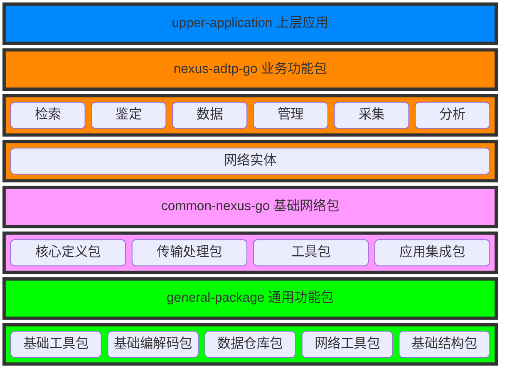

# Mermaid

```mermaid
---
title: Animal example
---
classDiagram
    note "From Duck till Zebra"
    Animal <|-- Duck
    note for Duck "can fly\ncan swim\ncan dive\ncan help in debugging"
    Animal <|-- Fish
    Animal <|-- Zebra
    Animal : +int age
    Animal : +String gender
    Animal: +isMammal()
    Animal: +mate()
    class Duck{
        +String beakColor
        +swim()
        +quack()
    }
    class Fish{
        -int sizeInFeet
        -canEat()
    }
    class Zebra{
        +bool is_wild
        +run()
    }

```

```mermaid
classDiagram
    IRepository~T~ <|-- IWarehouseRepository
    IWarehouseRepository <|-- WarehouseRepository: implements
    GenericRepository~T~ <|-- WarehouseRepository
    IRepository~T~ <|-- GenericRepository~T~: implements

    class GenericRepository~T~ {
        <<abstract>>
        #JobturaDbContext dbContext
        -ICachingService _cachingService
        -ILogger? _logger
    }
    class WarehouseRepository {
    }
    class IRepository~T~ {
        <<interface>>
        +GetByHashcodeAsync(string hashcode) Task~T?~
        +GetRangeAsync(int start, int limit) Task~List~T?~~
        +CreateAsync(T entity) Task
        +Task UpdateAsync(T entity) Task
        +DeleteAsync(string hashcode) Task
        +Search(Expression<Func&lt;T, bool&gt;> query) Task~List~T~~
    }
    class IWarehouseRepository {
        <<interface>>
    }

```

```mermaid
classDiagram
    IRepository <|-- IWarehouseRepository
    IWarehouseRepository <|-- WarehouseRepository: implements
    GenericRepository <|-- WarehouseRepository
    IRepository <|-- GenericRepository: implements

    class GenericRepository {
        <<abstract>>
        #JobturaDbContext dbContext
        -ICachingService _cachingService
        -ILogger? _logger
    }
    class WarehouseRepository {
    }
    class IRepository {
        <<interface>>
        +GetByHashcodeAsync(string hashcode) Task~T?~
        +GetRangeAsync(int start, int limit) Task~List~T?~~
        +CreateAsync(T entity) Task
        +Task UpdateAsync(T entity) Task
        +DeleteAsync(string hashcode) Task
        +Search(query: string) Task~List~T~~
    }
    class IWarehouseRepository {
        <<interface>>
    }


```

ffff

```mermaid
block-beta
  columns 5
    upper["upper-application 上层应用"]:5
    adtp["nexus-adtp-go 业务功能包"]:5
    block:servicepeer:5
        explorer("检索")
        aaa("鉴定")
        data("数据")
        manage("管理")
        gather("采集")
        analysis("分析")
    end
    block:core:5
        network_instance("网络实体")
    end
    nexus["common-nexus-go 基础网络包"]:5
    block:nx:5
        netif("核心定义包")
        moduletrans("传输处理包")
        modulecabinet("工具包")
        moduleapp("应用集成包")
    end
    bp["general-package 通用功能包"]:5
    block:basic:5
        koprulu/basicutil("基础工具包")
        koprulu/basiccodec("基础编解码包")
        koprulu/datawarehouse("数据仓库包")
        koprulu/networkutil("网络工具包")
        koprulu/infrastructure("基础结构包")
    end
    style upper fill:#08f,stroke:#333,stroke-width:4px
    style adtp fill:#f80,stroke:#333,stroke-width:4px
    style servicepeer fill:#f80,stroke:#333,stroke-width:4px
    style core fill:#f80,stroke:#333,stroke-width:4px
    style nexus fill:#f9f,stroke:#333,stroke-width:4px
    style nx fill:#f9f,stroke:#333,stroke-width:4px
    style bp fill:#0f0,stroke:#333,stroke-width:4px
    style basic fill:#0f0,stroke:#333,stroke-width:4px
```

