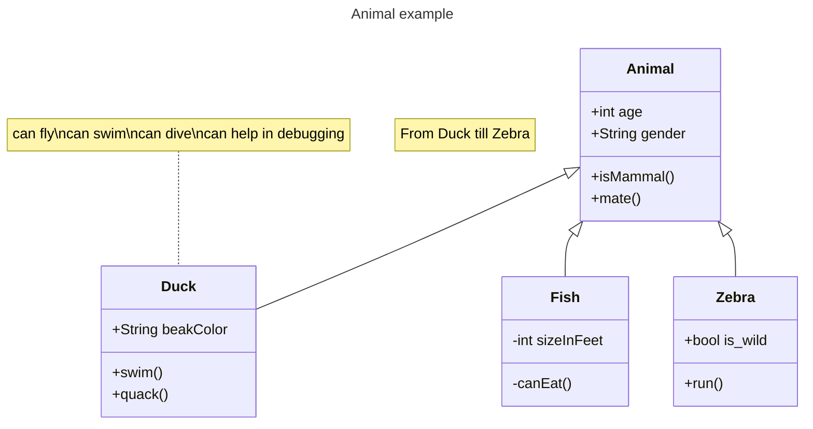
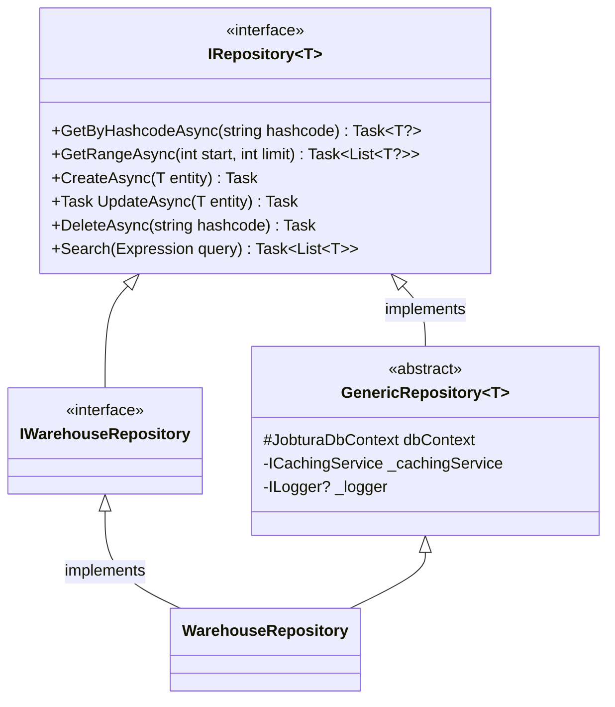

# Mermaid


```mermaid
---
title: Animal example
---
classDiagram
    note "From Duck till Zebra"
    Animal <|-- Duck
    note for Duck "can fly\ncan swim\ncan dive\ncan help in debugging"
    Animal <|-- Fish
    Animal <|-- Zebra
    Animal : +int age
    Animal : +String gender
    Animal: +isMammal()
    Animal: +mate()
    class Duck{
        +String beakColor
        +swim()
        +quack()
    }
    class Fish{
        -int sizeInFeet
        -canEat()
    }
    class Zebra{
        +bool is_wild
        +run()
    }

```



```mermaid
classDiagram
    IRepository~T~ <|-- IWarehouseRepository
    IWarehouseRepository <|-- WarehouseRepository: implements
    GenericRepository~T~ <|-- WarehouseRepository
    IRepository~T~ <|-- GenericRepository~T~: implements

    class GenericRepository~T~ {
        <<abstract>>
        #JobturaDbContext dbContext
        -ICachingService _cachingService
        -ILogger? _logger
    }
    class WarehouseRepository {
    }
    class IRepository~T~ {
        <<interface>>
        +GetByHashcodeAsync(string hashcode) Task~T?~
        +GetRangeAsync(int start, int limit) Task~List~T?~~
        +CreateAsync(T entity) Task
        +Task UpdateAsync(T entity) Task
        +DeleteAsync(string hashcode) Task
        +Search(Expression<Func&lt;T, bool&gt;> query) Task~List~T~~
    }
    class IWarehouseRepository {
        <<interface>>
    }

```


```mermaid
classDiagram
    IRepository <|-- IWarehouseRepository
    IWarehouseRepository <|-- WarehouseRepository: implements
    GenericRepository <|-- WarehouseRepository
    IRepository <|-- GenericRepository: implements

    class GenericRepository {
        <<abstract>>
        #JobturaDbContext dbContext
        -ICachingService _cachingService
        -ILogger? _logger
    }
    class WarehouseRepository {
    }
    class IRepository {
        <<interface>>
        +GetByHashcodeAsync(string hashcode) Task~T?~
        +GetRangeAsync(int start, int limit) Task~List~T?~~
        +CreateAsync(T entity) Task
        +Task UpdateAsync(T entity) Task
        +DeleteAsync(string hashcode) Task
        +Search(query: string) Task~List~T~~
    }
    class IWarehouseRepository {
        <<interface>>
    }


```

```
fff
```


