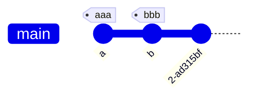

# API Reference

ffff

<table style="none">
<tr>
 <td>Student ID</td>
<td></td>
 <td>3741255</td>
 <td>3971244</td>
</tr>
<tr>
 <td colspan="2">Student</td>
 <td></td>
 <td>3741255</td>
 <td>3971244</td>
</tr>
<tr>
<td>First name</td>
<td>Last name</td>
<td></td>
<td></td>
</tr>
<tr>
 <td>Major</td>
 <td>Computer Science</td>
 <td>Russian Literature
</td>
</tr>
<tr>
 <td>Credits</td>
 <td>240</td>
 <td>220</td>
</tr>
</table>

ddddd

<table style="none">
  <tr>
    <td rowspan="2">Student ID</td>
    <td colspan="2">Student</td>
    <td rowspan="2">Major</td>
    <td rowspan="2">Credits</td>
  </tr>
  <tr>
    <td>First name</td>
    <td>Last name</td>
  </tr>
  <tr>
    <td>3741255</td>
    <td>Martha</td>
    <td>Jones</td>
    <td>Computer Science</td>
    <td>240</td>
  </tr>
  <tr>
    <td>3971244</td>
    <td>Victor</td>
    <td>Nim</td>
    <td>Russian Literature</td>
    <td>220</td>
  </tr>
  <tr>
    <td>4100332</td>
    <td>Alexandra</td>
    <td>Petrov</td>
    <td>Astrophysics</td>
    <td>260</td>
  </tr>
</table>

~col

<table style="header-column">
  <tr>
    <td></td>
    <td>Student ID</td>
    <td colspan="2">Student</td>
    <td>Major</td>
    <td>Credits</td>
  </tr>
  <tr>
    <td>First name</td>
    <td></td>
    <td>Martha</td>
    <td>Jones</td>
    <td>Computer Science</td>
    <td>240</td>
  </tr>
  <tr>
    <td>Last name</td>
    <td></td>
    <td>Victor</td>
    <td>Nim</td>
    <td>Russian Literature</td>
    <td>220</td>
  </tr>
  <tr>
    <td></td>
    <td>3741255</td>
    <td></td>
    <td></td>
    <td>Astrophysics</td>
    <td>260</td>
  </tr>
</table>
